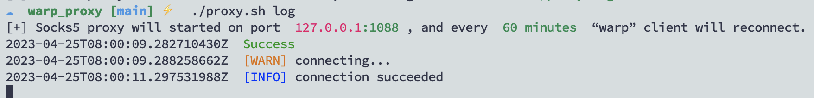

# WARP_PROXY
利用WARP构造 SOCKS v5代理服务器。

## 使用方法:
```
Usage: ./proxy.sh {build|start|stop|log} [host_port] [minute]
```

1. 编译镜像
```
chmod +x proxy.sh
./proxy.sh build
```


2. 运行socks5服务
```
./proxy start  # 默认开放在 127.0.0.1:1088,更换时间为1小时。
./proxy start  127.0.0.1:1088 10  
```

>其中 10 代表时间，将会间隔10分钟重新申请一个IP（IP有可能不更换）


3. 停止服务
```
./proxy stop
```

4. 查看运行日志
```
./proxy log
```


## 认证
如果想设置认证，可通过 [gost](https://github.com/ginuerzh/gost) 做一个转发
```
./gost -L admin:pass@0.0.0.0:9999 -F=socks5://127.0.0.1:1088
```

之后，就可以认证使用了：


## 本机运行

如果不想用docker，想直接在VPS上直接安装，可以参考：[warp.sh](https://github.com/P3TERX/warp.sh)